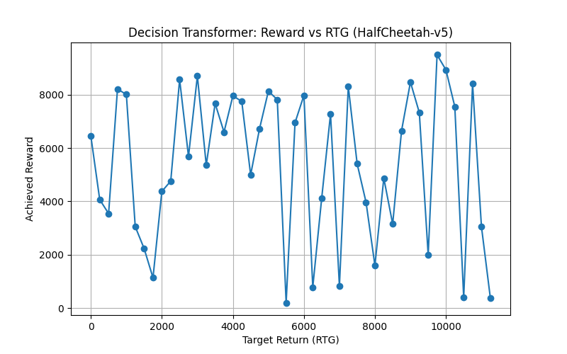

# Decision Transformer on HalfCheetah-v5 Expert Trajectories

This directory demonstrates applying the Decision Transformer to the HalfCheetah-v5 environment using offline expert demonstrations. The model learns to generate actions conditioned on a target return in a continuous control task, despite training purely on expert data.

---

## 📁 Folder Structure

```text
HalfCheetah/
├── config.py                      # Hyperparameters and normalization constants
├── DataLoader.py                  # PyTorch Dataset/DataLoader for trajectories
├── DifferentRTgPlot.py            # Script to plot reward vs. RTG curves
├── EvalDecisionTransformer.py     # Rollout and render model performance
├── model.py                       # Decision Transformer architecture (continuous actions)
├── saveVideo.py                   # Script to record model rollout to MP4
├── show_replay_dataset_...py      # Replay expert dataset for visualization
├── Train.py                       # Main training loop (MSE action loss)
├── Train_cnn.py                   # (Optional) CNN-based variant training
├── Train_tensorboard.py           # Training with TensorBoard logging
├── runs/                          # TensorBoard logs & checkpoints
└── ht_stats.npz                   # Precomputed dataset statistics (mean, std, returns)
```

---

## 🔧 Requirements

* **Python 3.11**
* Dependencies installed via:

  ```bash
  pip install -r requirements.txt
  ```
* Key packages:

  * `torch>=2.5.1`, `transformers`, `gymnasium`
  * `datasets` (HuggingFace), `numpy`, `matplotlib`, `tqdm`

---

## 🔍 Dataset

We use the **HalfCheetah‑expert‑v2** dataset from the [edbeeching/decision\_transformer\_gym\_replay](https://huggingface.co/datasets/edbeeching/decision_transformer_gym_replay/viewer/halfcheetah-expert-v2/train) repository. This offline dataset contains expert trajectories collected on the HalfCheetah-v5 MuJoCo environment, featuring continuous state (17‑dim) and action (6‑dim) sequences. The dataset comprises approximately 10K episodes and is licensed under Apache 2.0 ([huggingface.co](https://huggingface.co/datasets/edbeeching/decision_transformer_gym_replay/viewer/halfcheetah-expert-v2/train?utm_source=chatgpt.com), [huggingface.co](https://huggingface.co/datasets/edbeeching/decision_transformer_gym_replay/blob/main/data/halfcheetah-expert-v2.pkl?utm_source=chatgpt.com)).

The HalfCheetah environment is a 2D robot with 9 links and 8 joints; the goal is to apply torques to make it run forward as fast as possible, receiving positive reward for forward progress and negative for backward motion ([gymnasium.farama.org](https://gymnasium.farama.org/environments/mujoco/half_cheetah/?utm_source=chatgpt.com)).

---

## ⚙️ Configuration (`config.py`)

* `MAX_LENGTH`: Context length (e.g., 20 timesteps)
* `BATCH_SIZE`, `LR`, `EPOCHS`: Training hyperparameters
* `state_mean`, `state_std`: Normalization constants (loaded from `ht_stats.npz`)
* `scale`: Reward scaling factor
* `device`: Auto-select CUDA if available

Modify these values to experiment with context size, learning rate, or dataset splits.

---

## 🏗️ Model Architecture

The `DecisionTransformer` in `model.py` adapts the Decision Transformer for continuous actions:

1. **Backbone**: GPT-2 Transformer with frozen positional embeddings.
2. **Modality Embeddings**:

   * **State**: `nn.Linear(state_dim, H)`
   * **Action**: `nn.Linear(act_dim, H)`
   * **Return-to-Go**: `nn.Linear(1, H)`
   * **Timestep**: `nn.Embedding(max_length, H)`
3. **Embedding Fusion**: Sum each modality with its timestep embedding.
4. **Sequence Construction**: Interleave `[RTG_t, S_t, A_t]` into a length-`3T` sequence.
5. **Transformer Encoding**: Causally masked GPT-2 encodes the sequence.
6. **Prediction Heads**:

   * **Action Head**: Projects hidden states at state tokens to continuous actions, with optional `tanh` activation.
   * **State & RTG Heads**: (Optional) predict next state and return.

This design allows generating real-valued torques conditioned on desired return and past history, framing RL as sequence modeling ([arxiv.org](https://arxiv.org/abs/2106.01345?utm_source=chatgpt.com)).

---

## 🚀 Training & Evaluation

### Training

```bash
python Train.py
```

* Loads expert data from HuggingFace.
* Minimizes MSE between predicted and expert actions.
* Checkpoints saved every 5 epochs (e.g., `dt_epoch100.pt`).

### Evaluating & Recording

* **Model Rollout**:

  ```bash
  python EvalDecisionTransformer.py  # real-time rendering
  ```
* **Record Video**:

  ```bash
  python saveVideo.py                # outputs `halfcheetah_dt.mp4`
  ```
* **Plot RTG vs. Reward**:

  ```bash
  python DifferentRTgPlot.py         # generates `halfcheetah_rtg_vs_reward.png`
  ```

---

## 📸 Examples

### Expert Demonstration


*Expert trajectory from the offline HalfCheetah dataset.*

### Model Rollout


*Decision Transformer behavior in real-time (epoch 100). clipped video*

### Reward vs. Target RTG



*Achieved reward across RTGs from 0 to max returns, showing the model respects desired returns.*

---

## ⚖️ License

This project is released under the MIT License. Feel free to use and modify for research purposes.
