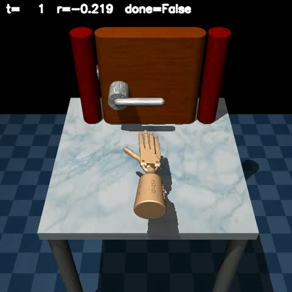
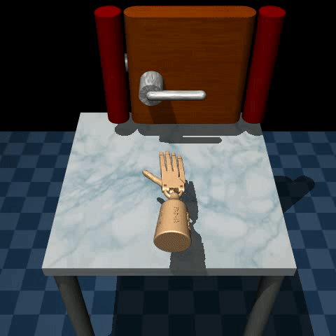
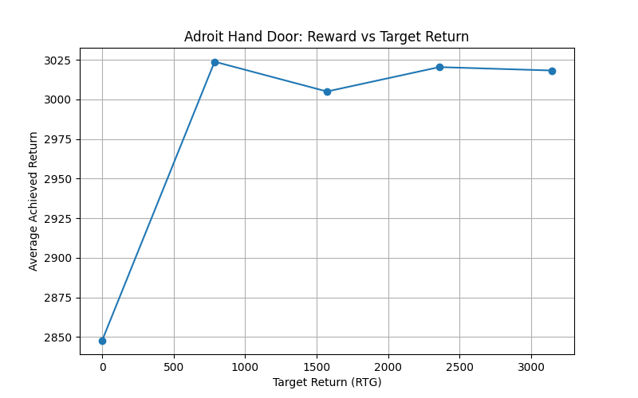

# Decision Transformer on Adroit Hand Door-v1 Expert Data

This directory applies a Decision Transformer to the Adroit Hand Door-v1 manipulation task using offline expert demonstrations from the Minari/D4RL suite. The model learns to generate continuous control signals for a dexterous hand opening a door, conditioned on a target return.

---

## 📁 Folder Structure

```text
adroit/
├── config.py                         # Hyperparameters and device setup
├── myDataLoader.py                   # PyTorch Dataset for fixed-length trajectory blocks
├── model_cnn.py                      # DecisionTransformerRC: CNN-based return-conditioned model
├── Train_minrari_adroit.py           # Training script (MSE action + RTG loss)
├── runs/                             # TensorBoard logs & saved checkpoints (e.g., dt_adroit_rc_epoch*.pt)
├── saveExpertVideo.py                # Record expert demonstration to MP4
├── saveVideo.py                      # Record model rollout to MP4
├── EvalAdroit.py                     # Record & display a single DT rollout
├── EvalDecisionTransformer.py        # RTG sweep evaluation (CNN model variant)
├── EvalRTGsAdroit.py                 # Print avg return over RTG fractions
├── PlotRTG_reward.py                 # Plot: average return vs. target RTG
└── show_replay_dataset_minrari_door.py  # Replay expert dataset frames
```

---

## 🔧 Requirements

* **Python 3.11**
* Install dependencies via:

  ```bash
  pip install -r requirements.txt
  ```
* Key libraries: `torch`, `transformers`, `minari`, `gymnasium-robotics`, `opencv-python`, `matplotlib`, `numpy`, `tqdm`.

---

## 🔍 Dataset

We use the **AdroitHandDoor-v1** dataset from Minari / D4RL (`minari.load_dataset("D4RL/door/expert-v2")`). This dataset contains expert trajectories of a 28‐dimensional action space dexterous hand opening a door in MuJoCo. Each trajectory includes state vectors (39‐dim), actions (28‐dim), and rewards, over \~20‐100 steps per episode.

---

## ⚙️ Configuration (`config.py`)

* `MAX_LENGTH`: Context length for DT (e.g., 20)
* `BATCH_SIZE`, `LR`, `EPOCHS`: Training hyperparameters
* `device`: Auto-select CUDA if available

Adjust as needed before training or evaluation.

---

## 🏗️ Model & Data Loader

### `myDataLoader.py`

* Implements `FullBlockVectorDataset` to sample contiguous blocks of length `MAX_LENGTH` from expert episodes.
* Returns `states`, `actions`, `returns_to_go`, `timesteps`, and `attention_mask` tensors.

### `model_cnn.py` (DecisionTransformerRC)

* **Backbone**: GPT-2 Transformer with frozen positional embeddings.
* **Modality Embeddings**:

  * **Return**: two-layer MLP + ReLU/Tanh
  * **State**: linear projection
  * **Action**: two-layer MLP + ReLU/Tanh
  * **Timestep**: learned embedding
* **Fusion**: Sum each modality with its timestep embedding.
* **Sequence**: Interleave `[R_t, S_t, A_t]` tokens → length `3·MAX_LENGTH`.
* **Transformer Encoding**: Causal GPT-2 encoder.
* **Heads**:

  * `predict_action`: continuous action outputs (MSE loss)
  * `predict_return`: next RTG prediction (MSE loss)
* **Inference**: `get_action` pads/crops history and returns the last action.

---

## 🚀 Training

```bash
python Train_minrari_adroit.py
```

* Loads expert data via Minari.
* Trains `DecisionTransformerRC` to minimize:

  * Mean squared error on actions (masked by valid timesteps)
  * * RTG prediction loss (scaled loss)
* Logs to TensorBoard under `runs/adroit_rc`.
* Checkpoints saved every 5 epochs (e.g., `dt_adroit_rc_epoch{epoch}.pt`).

---

## 🎥 Evaluation & Visualization

### Expert Replay


*Expert opening trajectory from Minari dataset.*

### Model Rollout (RTG = 0)


*DT behavior when target return-to-go = 0.*

### Quantitative RTG Sweep

```bash
python EvalRTGsAdroit.py
```

Prints average achieved return over fractions of expert max return.

### Plot Reward vs. RTG

```bash
python PlotRTG_reward.py
```


*Shows how the model respects different RTG targets.*

---
### Note on Dataset Quality and RTG Sensitivity

Because the AdroitHandDoor-v1 offline dataset comprises only expert demonstrations, the Decision Transformer never observes poor or random actions. Consequently, when sweeping different RTG targets, the model’s achieved returns cluster closely together, reflecting expert-level performance across the board. If one desires behavior variation—such as deliberately poor performance at low RTGs—the offline dataset must include trajectories of varying quality (e.g., random, suboptimal, medium, and expert). The Decision Transformer’s ability to modulate behavior truly depends on the **quality and diversity** of its offline RL data.

---

## ⚖️ License

This project is released under the MIT License. Feel free to use and adapt for research.
