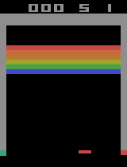
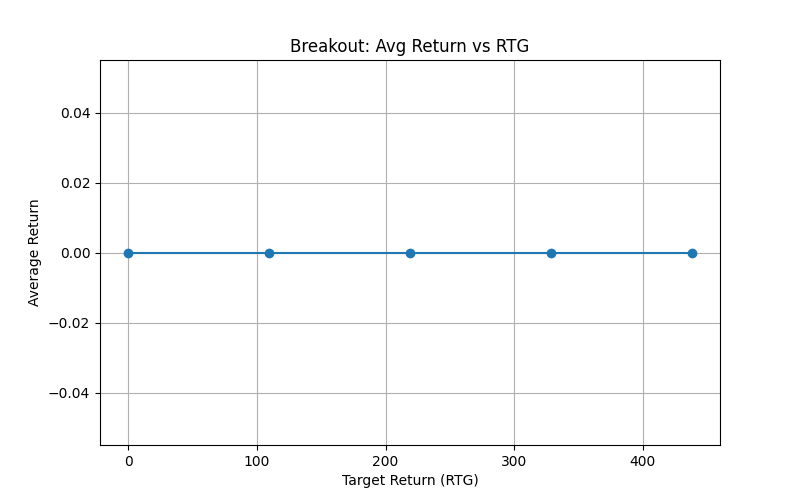

# Decision Transformer on Atari Breakout

This directory demonstrates applying a Decision Transformer to the **Breakout-v5** Atari environment using offline expert trajectories from the Minari library. The model learns to generate discrete actions conditioned on a target return in the challenging brick-breaking game.

---

## 📁 Folder Structure

```text
breakout/
├── config.py                       # Hyperparameters & device setup (omitted below)
├── myDataLoader.py                 # PyTorch Dataset for fixed-length Atari frames
├── model_cnn.py                    # CNN + GPT-2 DecisionTransformerCNN architecture
├── train.py                        # Training script on Minari expert-v0 data
├── runs/                           # TensorBoard logs & checkpoints
├── evalBreakout.py                 # RTG sweep & evaluation script
├── show_replay_dataset_minrari.py  # Replay Minari expert frames via OpenCV
└── testAtaridiffrentRTG.py         # Alternate RTG sweep test script
```

---

## 🔧 Requirements

* **Python 3.11**
* GPU: NVIDIA GTX 1050, 4 GB VRAM (training/eval on CPU due to large frame inputs; GPU supported if VRAM permits)
* Install dependencies:

  ```bash
  pip install -r requirements.txt
  ```
* Key packages: `torch`, `transformers`, `minari`, `gymnasium[atari]`, `opencv-python`, `numpy`, `matplotlib`, `tqdm`.

---

## 🔍 Dataset

We use the **atari/breakout/expert-v0** dataset from Minari, containing **10 expert episodes** of Breakout played to high scores (\~300–500 points per game). Each trajectory includes raw RGB frames (210×160×3), discrete actions (4 moves), and rewards (bricks broken).

Because the dataset consists only of near-optimal play, the Decision Transformer **never observes failures**. As a result, during RTG sweeps the agent **always loses quickly** and achieves near-zero reward, irrespective of target RTG. This underscores that the Decision Transformer’s ability to modulate behavior critically depends on **dataset size and diversity**.



*Expert Reply*

---

## 🏗️ Model & Data Loader

### `myDataLoader.py`

* Defines `FullBlockDataset` to sample contiguous blocks of `MAX_LENGTH` frames, actions, and computed returns-to-go (RTG).

### `model_cnn.py` (DecisionTransformerCNN)

* **CNN encoder**: Two convolutional layers map 3×H×W frames to a GPT-2 hidden embedding.
* **GPT-2 backbone**: Frozen positional embeddings interleave `[RTG_t, S_t, A_t]` tokens.
* **Heads**:

  * `predict_action`: logits over 4 discrete actions.
  * `predict_return`: next return-to-go prediction.

This architecture treats Breakout gameplay as sequence modeling for offline RL.

---

## 🚀 Training

```bash
python train.py
```

* Loads expert episodes via `minari.load_dataset("atari/breakout/expert-v0")`.
* Trains with cross-entropy loss on actions (no padding).
* Logs to `runs/minari_bearkout`.
* Checkpoints saved at epochs 5, 10, 15, … as `dt_cnn_no_pad_epoch_cpu_dis{epoch}.pt`.

---

## 🎥 Evaluation & RTG Sweep

### RTG Sweep & Evaluation

Run:

```bash
python evalBreakout.py
```

This script loads the trained model, sweeps target RTGs (0–max expert return), and prints average returns.

### Reward vs. Target RTG


*Achieved returns remain at \~0 across RTG targets (0–max), illustrating failure to learn from small expert-only dataset.*

Generate this plot with:

```bash
python testAtaridiffrentRTG.py
```

---

## ⚖️ Notes

* **Hardware**: GTX 1050  (4 GB) forced CPU training for high-dimensional frames.
* **Dataset Dependence**: Without suboptimal examples, the Decision Transformer cannot learn to achieve different behaviors for different RTGs; more diverse and larger datasets are required for effective offline RL.

---

## 📚 References

* Farama-Foundation Minari: offline Atari RL datasets
* Gymnasium Breakout environment spec

---

Released under the MIT License. Feel free to adapt for your offline RL experiments.
