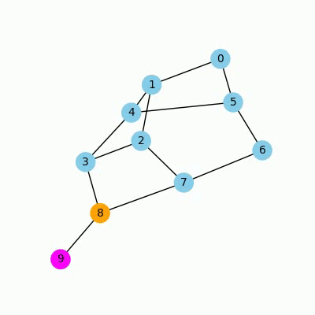
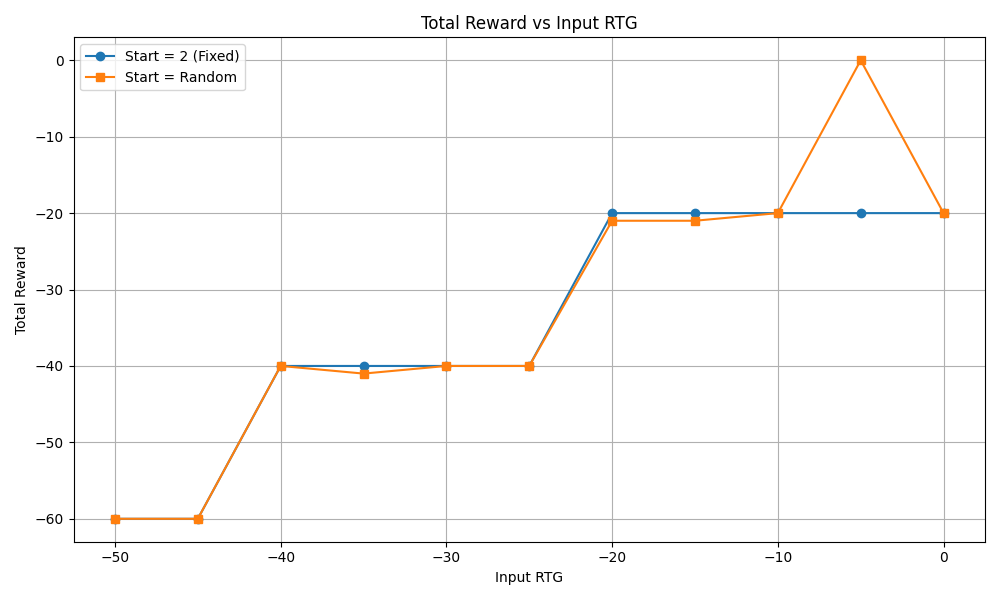

# Decision Transformer on Graph Random Walks

This directory contains an implementation of the Decision Transformer applied to random walk trajectories on a graph with a predefined goal node. Despite training on purely random data, the model learns to navigate efficiently toward the goal by conditioning on returns-to-go (RTG).

---

## 📁 Folder Structure

```text
graph/
├── config.py                  # Hyperparameters and device setup
├── build_graph_dataset.py     # Generate random-walk dataset (pickles)
├── inspect_dataset.py         # Quick dataset statistics and sanity checks
├── train_graph.py             # Training script (includes RTG loss)
├── evalGrapghDT.py            # Rollout evaluation from fixed or random starts (text & video)
├── graph_env.py               # Custom Gym environment for graph navigation
├── model_graph.py             # Decision Transformer model for graphs
├── myDataLoader.py            # PyTorch Dataset/DataLoader for trajectories
└── runs/                      # TensorBoard logs & checkpoint files
```

---

## 🔧 Requirements

* **Python 3.11**
* All dependencies captured in the root `requirements.txt` (run `pip freeze > requirements.txt` to regenerate).
* To install, from the project root run:

  ```bash
  pip install -r requirements.txt
  ```

---

## ⚙️ Configuration (`config.py`)

* `device`: Auto-select CUDA if available
* `MAX_LENGTH`: Context length for the transformer (e.g., 20)
* `BATCH_SIZE`, `LR`, `EPOCHS`: Training hyperparameters
* `DATA_FILE`: Path to the generated pickle file

Adjust as needed before running.

---

## 🏗️ Model Architecture

The `DecisionTransformerRCGraph` model in `model_graph.py` follows the Decision Transformer design:

1. **Backbone**: GPT-2 Transformer from HuggingFace (`gpt2`), with positional embeddings zeroed out and frozen.
2. **Modality Embeddings**:

   * **State**: `nn.Embedding(num_nodes, H)`
   * **Action**: `nn.Embedding(num_nodes, H)` followed by `nn.Tanh()`
   * **Returns-to-Go (RTG)**: `nn.Linear(1, H)`
   * **Timestep**: `nn.Embedding(max_length, H)`
3. **Embedding Fusion**: Each modality embedding is summed with the timestep embedding.
4. **Sequence Construction**: States, actions, and RTG are interleaved into a length‑`3T` embedding sequence: `[RTG_1, S_1, A_1, RTG_2, S_2, A_2, …]`.
5. **Transformer Encoding**: The sequence is fed into the GPT-2 encoder to produce contextualized hidden states.
6. **Prediction Heads**:

   * **Action Head**: Linear layer mapping hidden states at state positions to logits over actions.
   * **RTG Head**: Linear layer predicting next return-to-go.
7. **Masking**: During both training and inference, an action validity mask (`valid_mask`) prevents the model from selecting invalid moves (e.g., non-neighbors or staying in place).

This architecture enables conditioning future action predictions on desired returns and past trajectories, adapting sequence modeling for goal‑directed decision making.

---

## 📊 Data Generation & Inspection

1. **Generate dataset**:

   ```bash
   python build_graph_dataset.py  # saves `graph_random_10000.pkl`
   ```
2. **Inspect dataset**:

   ```bash
   python inspect_dataset.py      # prints episode counts, lengths, reward stats
   ```

---

## 🚀 Training

```bash
python train_graph.py
```

* Trains for `EPOCHS` epochs on the random-walk data.
* Includes auxiliary RTG prediction loss to encourage accurate return estimation.
* Saves checkpoints every 2 epochs in `runs/` and final model as `dt_graph_masked_rtg.pt`.

---

## 🎥 Evaluation & Visualization

* **Text rollout**:

  ```bash
  python evalGrapghDT.py             # prints step-by-step actions & total reward
  ```
* **Record video**:

  ```bash
  python evalGrapghDT.py --save_video # outputs `graph_episode.mp4`, `state-*-RTG-*.mp4`
  ```
* **Plot RTG vs. Reward**:

  ```bash
  python train_graph.py --plot        # generates `2_rtg_vs_reward_comparison.png`
  ```

---

## 📸 Examples

### Rollout at RTG = 0




*The agent goes directly to the goal when conditioned on RTG = 0.*

### Rollout at RTG = -15


*With RTG = -15, the agent delays reaching the goal to collect a near -15 return.*

### RTG vs. Reward Plot



*Total reward collected for RTGs from -50 to 0 (step 5) shows behavior adapts to target returns.*

---

## 📝 Results

* Models learn to reach the goal more efficiently as target RTG increases.
* Despite training on random trajectories, RTG conditioning induces goal-directed behavior.
* See above videos and plot for qualitative and quantitative validation.

---

## 📚 References

* Chen, L. et al. "Decision Transformer: Reinforcement Learning via Sequence Modeling"
* Implementation inspired by the original Decision Transformer paper.

---

## ⚖️ License

This project is released under the MIT License. Feel free to use and modify for research purposes.
