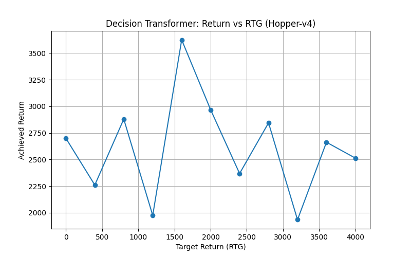

# Hopper Baseline (HuggingFace DecisionTransformer)

This directory provides a reference implementation using the pretrained HuggingFace DecisionTransformer for the **Hopper-v4** task. It demonstrates how target return conditioning behaves when applied to expert trajectories.

---

## Contents

* **hopper\_dt.mp4**: Example rollout video of the model conditioned on a target RTG.
* **dt\_rtg\_vs\_reward\_hopper.png**: Plot showing achieved returns vs. target RTGs.
* **plotDiffrentRTG.py**: Evaluates the pretrained model over a range of RTGs and produces the above plot.
* **saveVideo.py**: Runs a single episode at a user-specified RTG and saves it as `hopper_dt.mp4`.
* **UsingTransformerInfrence.py**: Minimal example of loading the HuggingFace DT model and querying actions step by step in a live environment.

---

## Dataset

This model is pretrained on expert trajectories from the **D4RL Hopper-v4** dataset, hosted on HuggingFace under `edbeeching/decision-transformer-gym-hopper-expert`. The dataset comprises high-quality offline RL episodes collected from the Hopper-v4 environment.

---

## Dependencies

* Python 3.11+
* torch
* transformers
* gymnasium
* numpy
* matplotlib
* opencv-python

Install with:

```bash
pip install torch transformers gymnasium numpy matplotlib opencv-python
```

---

## Usage

1. **Evaluate RTG vs Reward**

   ```bash
   python plotDiffrentRTG.py
   ```

   * Outputs `dt_rtg_vs_reward_hopper.png`.

2. **Record Rollout Video**

   ```bash
   python saveVideo.py
   ```

   * Produces `hopper_dt.mp4` (default RTG can be set in the script).

3. **Interactive Inference**

   ```bash
   python UsingTransformerInfrence.py
   ```

   * Runs the model in `human` render mode and prints out selected weights.

---

## Results



* Note how increasing the RTG beyond a certain point does not improve—and can even reduce—the achieved return.
* The highest returns often occur at **sub-maximal** RTG settings.

---

## Comparison

Our custom DecisionTransformer experiments on **HalfCheetah** yield a similar phenomenon: conditioning on extremely high target returns does not guarantee better performance, and the optimal RTG often lies below the expert maximum. This underscores that a DecisionTransformer’s effectiveness critically depends on the quality and distribution of its offline RL dataset.
