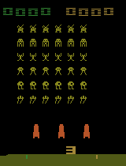
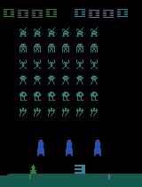
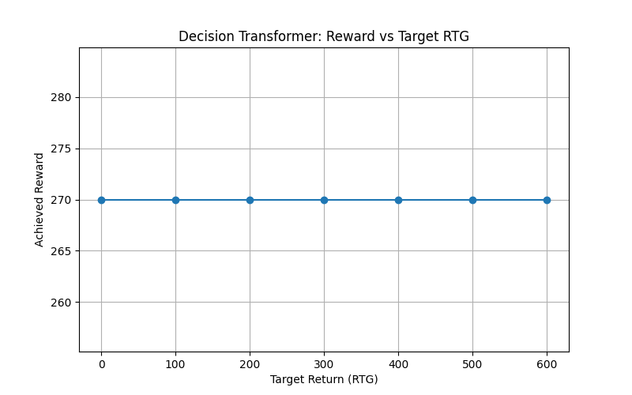

# Decision Transformer on Atari Space Invaders (spaceVader)

This directory demonstrates applying a Decision Transformer to the **SpaceInvaders-v4** Atari environment using offline expert trajectories from the Minari library. The model learns to generate discrete actions conditioned on a target return in a classic Atari breakout-style game.

---

## 📁 Folder Structure

```text
spaceVader/
├── config.py                       # Hyperparameters and device setup
├── myDataLoader.py                 # PyTorch Dataset for fixed‐length Atari frames
├── model_cnn.py                    # CNN + GPT-2 DecisionTransformerCNN architecture
├── train_minrari.py                # Training script on Minari expert-v0 data
├── runs/                           # TensorBoard logs & checkpoints
├── plotDIffrentRTG.py              # Script to sweep RTG and plot rewards
├── EvalDecisionTransfomerAtariSpace.py  # Script to run DT agent in real‐time & record video
└── show_replay_dataset_minrari.py  # Replay Minari dataset frames via OpenCV
```

---

## 🔧 Requirements

* **Python 3.11**
* GPU: NVIDIA GTX 1050, 4 GB VRAM (CPU used here due to large state dims; GPU usage also supported if VRAM permits)
* Install dependencies:

  ```bash
  pip install -r requirements.txt
  ```
* Key packages: `torch`, `transformers`, `minari`, `gymnasium[atari]`, `opencv-python`, `numpy`, `matplotlib`, `tqdm`.

---

## 🔍 Dataset

We use the **atari/spaceinvaders/expert-v0** dataset from the Minari library, which provides offline expert trajectories for Atari games ([minari.farama.org](https://minari.farama.org/main/datasets/mujoco/inverteddoublependulum/expert-v0/?utm_source=chatgpt.com)). The dataset contains only 10 expert episodes of Space Invaders played to high scores (\~2000–3500 points). Each trajectory consists of raw RGB frames (210×160×3), discrete actions (6 possible moves), and rewards (game score increments).

Using such a small expert-only dataset means the model never observes suboptimal behaviors. As a result, during RTG sweeps, the agent’s performance remains constant (\~270 points per episode), regardless of target RTG. This highlights that the Decision Transformer’s behavior modulation critically depends on **dataset size and diversity**.

---

## 🏗️ Model & Data Loader

### `myDataLoader.py`

* Defines `FullBlockDataset` to sample contiguous blocks of `MAX_LENGTH` frames, actions, and computed returns-to-go (RTG).

### `model_cnn.py` (DecisionTransformerCNN)

* **CNN encoder**: Two convolutional layers to map 3×H×W frames to hidden embeddings.
* **GPT-2 backbone**: Frozen positional embeddings, interleaves `[RTG_t, S_t, A_t]` tokens.
* **Heads**:

  * `predict_action`: logits over 6 discrete actions.
  * `predict_return`: next return-to-go prediction.

This architecture enables treating Atari gameplay as sequence modeling for offline RL ([gymnasium.farama.org](https://gymnasium.farama.org/v0.29.0/environments/atari/space_invaders/?utm_source=chatgpt.com)).

---

## 🚀 Training

```bash
python train_minrari.py
```

* Loads expert episodes via `minari.load_dataset("atari/spaceinvaders/expert-v0")`.
* Trains with cross‐entropy loss on actions (no padding variant).
* Logs to `runs/minari_dt_no_pad`.
* Checkpoints at epochs 5, 10, 15, ….

---

## 🎥 Evaluation & Visualization

### Expert Replay



*First‐episode expert demonstration saved to MP4.*

### DT Agent Rollout (Fixed RTG)



*DT agent playing Space Invaders at a target return of 10.*

### Reward vs. Target RTG


*Achieved reward remains \~270 across RTG targets (0–2000), illustrating the need for larger/diverse datasets.*

Generate this plot with:

```bash
python plotDIffrentRTG.py
```

---

## ✏️ RTG Sweep Script

`plotDIffrentRTG.py` and `EvalDecisionTransfomerAtariSpace.py` allow you to:

1. Sweep `target_return` values and record achieved scores.
2. Visualize per‐RTG performance.

---

## 📚 References

* Farama-Foundation Minari: Python library for offline RL datasets ([minari.farama.org](https://minari.farama.org/main/datasets/mujoco/inverteddoublependulum/expert-v0/?utm_source=chatgpt.com))
* Gymnasium SpaceInvaders environment spec ([gymnasium.farama.org](https://gymnasium.farama.org/v0.29.0/environments/atari/space_invaders/?utm_source=chatgpt.com))

---

## ⚖️ License

This project is released under the MIT License. Feel free to modify for your research.
